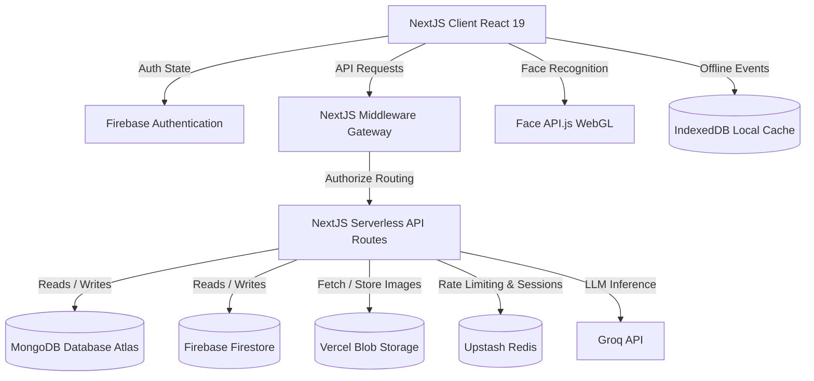
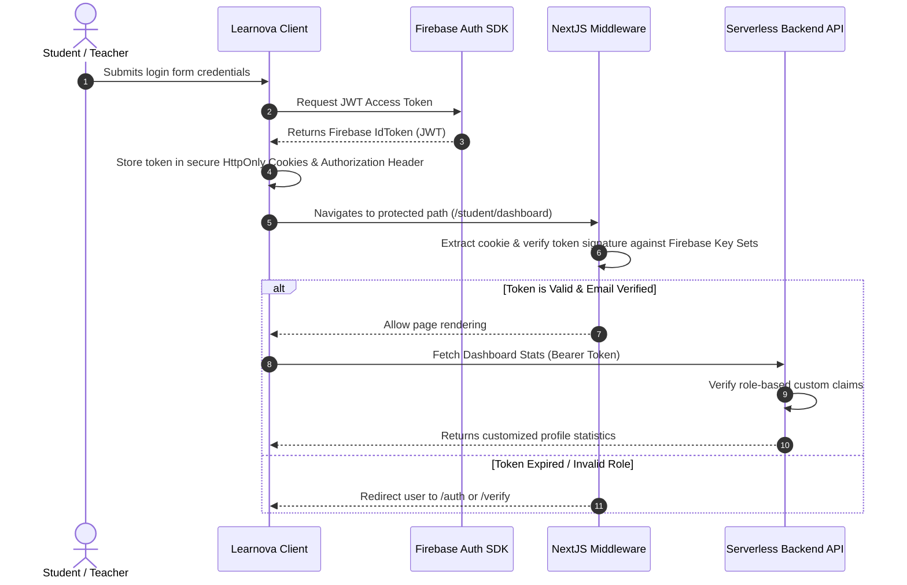
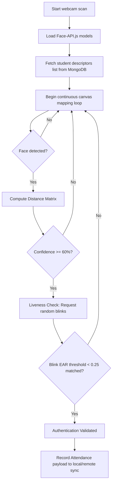

# 🏗️ Learnova System Architecture Blueprint

This document provides a detailed architectural blueprint of the **Learnova** platform, targeting maintainers and incoming developers. It covers token pipelines, face recognition workflows, data flow, service responsibilities, and offline sync strategies.

---

## Table of Contents

- [High-Level System Diagram](#high-level-system-diagram)
- [Technology Responsibilities](#technology-responsibilities)
- [Authentication & Security Token Pipeline](#authentication--security-token-pipeline)
- [Role Synchronisation](#role-synchronisation)
- [Attendance Data Flow](#attendance-data-flow)
- [Face API.js Liveness & Recognition Pipeline](#face-apijs-liveness--recognition-pipeline)
- [Firebase vs MongoDB — Responsibility Split](#firebase-vs-mongodb--responsibility-split)
- [File Storage — Vercel Blob](#file-storage--vercel-blob)
- [Real-Time Notices — Redis + SSE](#real-time-notices--redis--sse)
- [AI Services](#ai-services)
- [Session Management](#session-management)
- [Role-Based Access Control](#role-based-access-control)
- [Offline Synchronisation Strategy](#offline-synchronisation-strategy)
- [Cron Jobs](#cron-jobs)
- [Repository Directory Reference](#repository-directory-reference)
- [Deployment](#deployment)

---

## High-Level System Diagram

Learnova is built on a hybrid Next.js 15 App Router architecture, blending client-side React 19 dashboards with high-performance serverless API routes.



---

## Technology Responsibilities

| Technology | What it owns |
|---|---|
| **Firebase Auth** | User identity, email verification, password reset, custom role claims on JWT |
| **Firestore** | User profiles, notices, attendance records (real-time reads), stats |
| **MongoDB Atlas** | Attendance records (operational queries), face descriptors, courses, notifications, gamification |
| **Vercel Blob** | Profile avatars, face registration photos (`labels/`), uploaded files |
| **Redis (Upstash)** | Rate limiting, session tokens, SSE notice publishing, cron deduplication |
| **Face API.js** | Client-side face detection and 128-D descriptor generation — runs entirely in the browser |
| **Groq API** | LLM inference for AI chatbot, Study AI, and productivity recommendations |
| **Vercel** | Hosting, serverless functions, cron job scheduling, edge network |

---

## Authentication & Security Token Pipeline

Route security relies on a dual-stage token check — client-side verification plus cryptographic Next.js middleware token checking.



---

## Role Synchronisation

Firebase custom claims are cached in the JWT for up to 1 hour. After a role change:

1. Admin calls `POST /api/auth/set-role` → Firebase custom claim updated
2. Client polls `GET /api/auth/me` → compares `role` (Firestore, authoritative) vs `jwtRole` (JWT claim)
3. If `rolesInSync: false` → client calls `firebase.auth().currentUser.getIdToken(true)` to force a token refresh
4. New token with updated claim is used for all subsequent requests

---

## Attendance Data Flow

### 1. Face Registration (one-time, per student)

```
Student opens /register
        │
        ▼
Face API.js loads models from /public/models/
        │
        ▼
Student's face captured → 128-D descriptor generated (client-side, WebGL)
        │
        ▼
POST /api/register  (multipart/form-data)
  Fields: name, rollNo, email, photo (file), faceDescriptor (JSON)
        │
        ├─ Validates file magic bytes, size, MIME type
        ├─ Uploads photo → Vercel Blob  (labels/<name>/<uuid>.jpg)
        └─ Writes to MongoDB users collection:
             { name, rollNo, email, image: blobUrl, faceDescriptor, firebaseUid }
```

### 2. Daily Attendance (face recognition session)

```
Teacher starts attendance session
        │
        ▼
Student opens attendance page → webcam stream starts
        │
        ▼
Face API.js pipeline:
  TinyFaceDetector  → detects face in frame
  FaceLandmark68    → maps 68 facial landmark points
  FaceRecognition   → generates 128-D descriptor
  Matcher           → Euclidean distance vs stored descriptors
  Confidence score  → 0–100
        │
        ▼
POST /api/attendance/record
  { userId, studentName, email, confidenceScore (≥60), date }
        │
        ├─ student can only submit own record (teachers/admins exempt)
        ├─ confidenceScore < 60 → 400 rejected
        └─ Saga writes to MongoDB + Firestore (with compensating rollback)
```

---

## Face API.js Liveness & Recognition Pipeline



Only the 128-D face descriptor (a float array) is transmitted to the server — no raw video or images are sent during recognition.

---

## Firebase vs MongoDB — Responsibility Split

Both databases store some overlapping data intentionally to support both real-time reads (Firestore) and complex aggregation queries (MongoDB).

| Data | Firebase Firestore | MongoDB |
|---|---|---|
| User profiles | ✅ Auth / role source of truth | ✅ Extended profile + face descriptor |
| Attendance records | ✅ Real-time dashboard reads | ✅ Operational queries, aggregations |
| Notices | ✅ Primary store | ✅ Mirror for SSE change stream |
| Stats | ✅ Per-user stat counters | ❌ |
| Gamification | ❌ | ✅ XP, streak, badges |
| Courses / Curriculum | ❌ | ✅ |
| Notifications | ❌ | ✅ |
| Conversations | ❌ | ✅ |

`POST /api/admin/reconcile` and the reconciliation cron job detect and fix inconsistencies between the two stores. The saga pattern in `lib/transactionCoordinator.js` ensures writes to both stores are atomic with compensating rollbacks on failure.

---

## File Storage — Vercel Blob

All user-uploaded files go to Vercel Blob. MongoDB stores the public URL — never the raw file.

**Storage paths**

| Path prefix | Contents |
|---|---|
| `labels/<name>/<uuid>.<ext>` | Face registration photos |
| `avatars/<uid>/...` | Profile avatars |

On saga rollback, `del(url)` removes the blob before the MongoDB record is rolled back.

---

## Real-Time Notices — Redis + SSE

```
Teacher POSTs /api/notices
        │
        ├─ 1. Write to Firestore (primary store)
        ├─ 2. Mirror to MongoDB (SSE change stream fallback)
        └─ 3. publishNoticeToRedis(notice)
                  │
                  ▼
           Redis pub/sub channel
                  │
                  ▼
           GET /api/notices/stream  (SSE — open connection per client)
                  │
                  ▼
           Client EventSource receives notice instantly
```

Redis also handles rate limiting (sliding window per `ip_uid`), session storage, and cron deduplication.

---

## AI Services

### Groq (chatbot + productivity)
- `POST /api/groq` — user messages → Groq LLM → response
- `POST /api/ai-productivity` — study session data → productivity recommendations

### Study AI (RAG)
- `POST /api/StudyAI/embed` — teacher uploads material → embeddings stored in MongoDB
- `POST /api/StudyAI/retrieve` — student query → semantic search → relevant chunks → LLM answer

---

## Session Management

Learnova uses a two-layer session system:

| Layer | Technology | TTL | Purpose |
|---|---|---|---|
| Firebase ID token | Stateless JWT (httpOnly cookie `authToken`) | 1 hour | Carries uid, email, role claim — verified on every request |
| Redis session | Stateful (`sessionId` cookie) | 1 hour | Allows server-side termination by admin |

If the Firebase token is valid but the Redis session is missing or terminated, the user is treated as logged out.

---

## Role-Based Access Control

Five roles are defined in `constants/userRoles.js`:

| Role | Access |
|---|---|
| `student` | Own attendance, own stats, own gamification, courses, notices (read) |
| `teacher` | All student data in their institute, attendance management, notices (write) |
| `staff` | Notices (write), institute management |
| `admin` | Full access to all endpoints, session management, reconciliation |
| `parent` | Read-only access to linked student's attendance, grades, notices |

`requireRole(request, allowedRoles)` in `lib/rbac.js` checks the JWT claim on every protected request.

---

## Offline Synchronisation Strategy

When network connection drops, Learnova enters a persistent PWA fallback queue:

1. **IndexedDB Intercept** — if `navigator.onLine` is false, `FaceRecognizer` diverts attendance payloads into a local IndexedDB buffer instead of calling the API
2. **Connectivity Listener** — the browser registers `window` listeners tracking `online` events
3. **Queue Replay** — once the connection recovers, `syncService.js` processes queued records sequentially and flushes them to the MongoDB backend

---

## Cron Jobs

Scheduled via Vercel Cron (configured in `vercel.json`):

| Job | Schedule | What it does |
|---|---|---|
| `POST /api/cron/attendance-risk` | Nightly | Scans MongoDB for students below attendance threshold, flags them |
| `POST /api/cron/attendance-warnings` | Nightly | Sends warning notifications to at-risk students and their parents |

Both jobs use Redis to prevent duplicate execution.

---

## Repository Directory Reference

```
learnova/
├── .github/                  # CI/CD Workflows & Issue/PR Checklists
├── app/                      # App Router page components & Next.js layout layers
│   └── api/                  # 50+ serverless API route handlers
├── components/               # Shareable UI elements (ThemeProviders, noticeboards)
├── constants/                # Project constants & default configurations
├── contexts/                 # Global Context singletons (Auth & Notices)
├── docs/                     # Onboarding documentation & blueprints
├── hooks/                    # Custom React Hooks (useAuth, useAttendance)
├── lib/                      # Core libraries (Firebase, MongoDB, RBAC, sessions)
├── prisma/                   # (if applicable) schema definitions
├── public/
│   └── models/               # Face API.js model weight files
├── services/                 # Remote API integration layers
└── utils/                    # Shared helper methods
```

---

## Deployment

```
GitHub (master branch)
        │
        ▼ push / PR merge
Vercel (automatic deployment)
  - Builds Next.js app
  - Deploys serverless functions for each API route
  - Configures cron jobs from vercel.json
  - Environment variables set in Vercel dashboard

External services (always-on):
  - MongoDB Atlas   — managed cloud cluster
  - Firebase        — managed by Google
  - Upstash Redis   — managed serverless Redis
  - Vercel Blob     — managed by Vercel
  - Groq API        — managed by Groq
```

For local setup, see [TROUBLESHOOTING.md](./TROUBLESHOOTING.md).
For API reference, see [API.md](./API.md).
For face recognition setup, see [FACE_RECOGNITION.md](./FACE_RECOGNITION.md).
