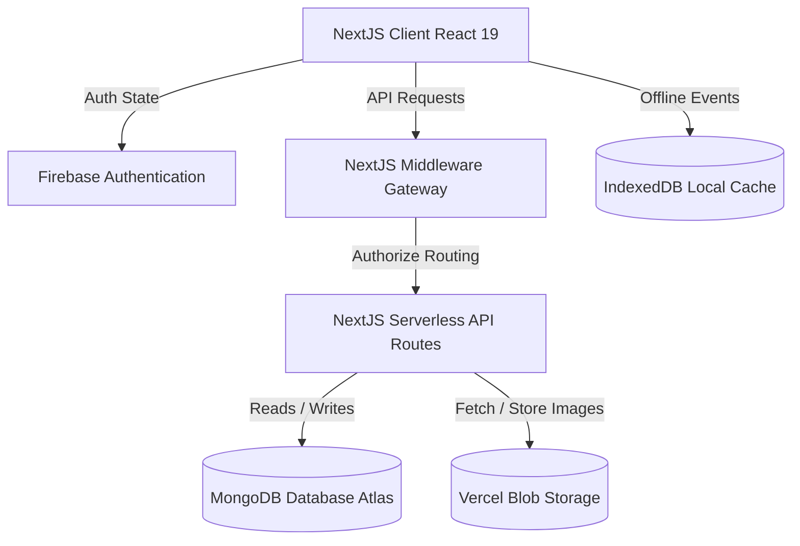
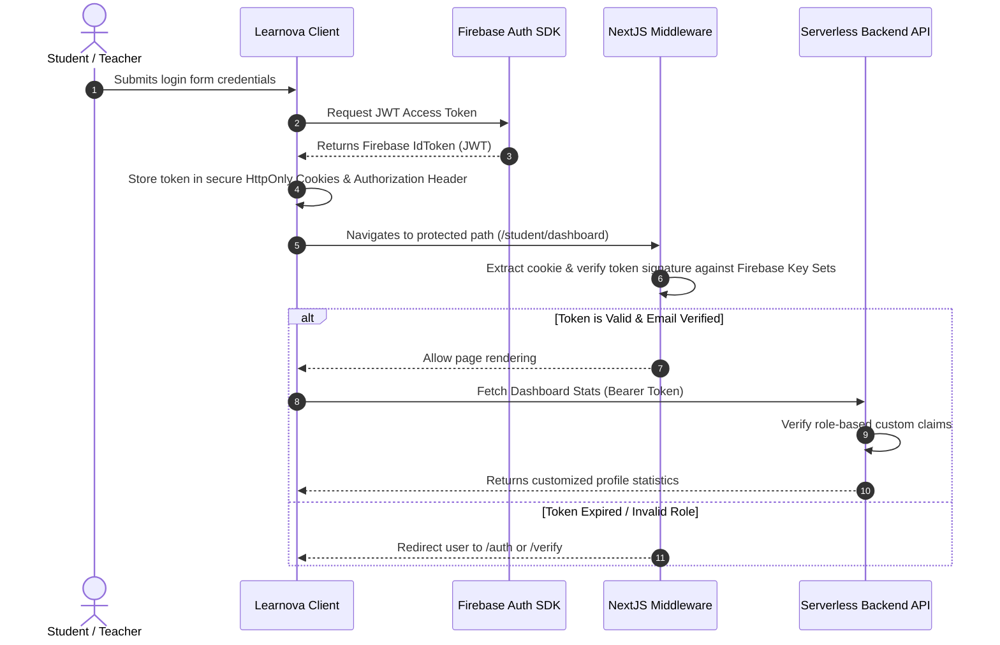
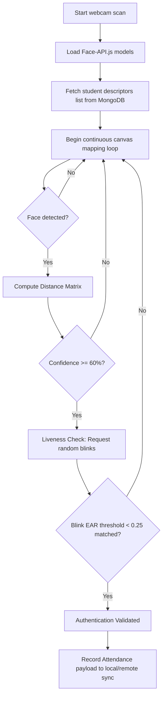

# 🏗️ Learnova System Architecture Blueprint

This document provides a highly detailed, advanced architectural blueprint of the **Learnova** platform, targeting maintainers and incoming developers. It details token pipelines, face recognition authentication workflows, offline sync strategies, and data entity relations.

---

## 🗺️ High-Level System Architecture

Learnova is designed around a hybrid Next.js 15 App Router architecture, blending client-side React 19 interactive dashboards with high-performance edge/node serverless routes.



---

## 🔑 Authentication & Security Token Pipeline

Our route security relies on a dual-stage token check (client-side verification + cryptographic Next.js middleware token checking).



---

## 📸 Face API.js Liveness & Recognition Pipeline

The automated attendance engine integrates a client-side Neural Network model to perform face verification and avoid anti-spoofing attacks (liveness detection).



---

## 📡 Offline Synchronization Strategy (PWA Queue)

When network connection drops, Learnova enters a persistent, standard-compliant fallback queue utilizing local browser storage:

1. **IndexedDB Intercept**: If `navigator.onLine` is false, `FaceRecognizer` diverts attendance payloads directly into a local IndexedDB buffer.
2. **Connectivity Listener**: The browser registers window listeners tracking `online` events.
3. **Queue Replay**: Once the connection recovers, `syncService.js` processes the queue records sequentially via background task loops and flushes them safely into the MongoDB backend.

---

## 📁 Repository Directory Reference

```
learnova/
├── .github/                  # CI/CD Workflows & Issue/PR Checklists
├── app/                      # App Router page components & NextJS layout layers
├── components/               # Shareable Visual UI elements (ThemeProviders, noticeboards)
├── constants/                # Project constants & default configurations
├── contexts/                 # Global Context singletons (Auth & Notices Pooling)
├── docs/                     # Comprehensive onboarding documentation & blueprints
├── hooks/                    # Reusable Custom React Hooks (useAuth, useAttendance)
├── lib/                      # Cryptographic configuration libraries (Firebase config)
├── services/                 # Remote API integration layers (Auth & DB requests)
└── utils/                    # Shared helper methods
```
